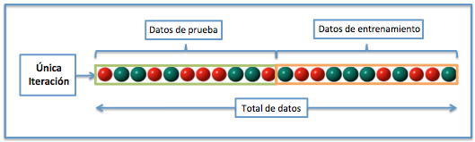
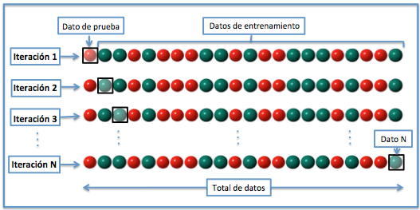

```{r setup, include = FALSE}
library(knitr)                              # paquete que trae funciones utiles para R Markdown
library(tidyverse)                          # paquete que trae varios paquetes comunes en el tidyverse
library(datos)                              # paquete que viene con datos populares traducidos al español :)
library(shiny)
# opciones predeterminadas
knitr::opts_chunk$set(echo = FALSE,         # FALSE: los bloques de código NO se muestran
                      dpi = 300,            # asegura gráficos de alta resolución
                      warning = FALSE,      # los mensajes de advertencia NO se muestran
                      error = FALSE)        # los mensajes de error NO se muestran


options(htmltools.dir.version = FALSE)
```


class: inverse, left, bottom
background-image: url("img/fondo.jpg")
background-size: cover


# **`r rmarkdown::metadata$title`**
----

## **`r rmarkdown::metadata$subtitle`**

### `r rmarkdown::metadata$author`
### `r rmarkdown::metadata$date`


```{r xaringanExtra-share-again, echo=FALSE}
xaringanExtra::use_share_again()
```

```{r xaringanExtra-clipboard, echo=FALSE}
xaringanExtra::use_clipboard()
```


---


class: center, middle


```{r, echo=FALSE, fig.align="center", out.width="20%"}
knitr::include_graphics("img/univalle.jpg")
```


---


class: center, middle


.center[

<br>


<a href="https://www.joaquibarandica.com" target="_blank">
  
</a>


## Orlando Joaqui-Barandica


Doctor en Ingeniería, Enf. Ingeniería Industrial **|** Magíster en Economía Aplicada **|** Estadístico.


`r anicon::faa("envelope", animate = "passing")` orlando.joaqui@correounivalle.edu.co 
]


.center[
### [www.joaquibarandica.com](https://www.joaquibarandica.com)
]


---


class: center, middle

# `r icon("play-circle")`
# ¿Por dónde arrancamos el Bloque B?

---

# Idea central del cambio de enfoque

.pull-left[
### En el Bloque A
- Ajustábamos modelos para **explicar** relaciones.
- Mirábamos coeficientes, pruebas t, ANOVA, supuestos.
- La pregunta típica era:  
  **¿qué efecto tiene X sobre Y?**
]

.pull-right[
### En el Bloque B
- Ajustamos modelos para **predecir bien**.
- Nos importa mucho cómo se comporta el modelo en **datos no vistos**.
- La pregunta típica ahora es:  
  **¿qué tan bien predice fuera de la muestra?**
]

--

.center[
.orange[.font130[La gran idea de hoy: un modelo no se evalúa donde se entrenó.]]
]

---

class: center, middle, inverse

# Error clásico
## Ajustar y evaluar con los mismos datos

---

# ¿Cuál es el problema?

Si yo ajusto un modelo con una base de datos y luego lo evalúo sobre esa **misma** base:

--

- el modelo ya "vio" esos datos,
- ya se acomodó a ellos,
- y el desempeño que reporto suele verse **mejor de lo que realmente es**.

--

.center[
.orange[.font150[Eso produce una evaluación demasiado optimista.]]
]

---

# Analogía simple

.center[.font150[**Entrenar y evaluar en los mismos datos es como estudiar con las respuestas del examen... y luego presentar ese mismo examen.**]]

--

### Lo correcto sería:

- **Train** = para aprender.
- **Validation** = para comparar opciones y tomar decisiones.
- **Test** = para el examen final.

---

# Entonces, ¿qué se hace?

### Se divide la base de datos en partes

1. Una parte para **entrenar** el modelo.
2. Otra parte para **probarlo** en datos no vistos.

--

### Y si además voy a comparar varias alternativas:

- dejo una parte interna para **validación**,
- y reservo el **test** para el final.

---

class: center, middle

# `r icon("project-diagram")`
# Esquema general

.center[.font140[
Datos completos  
$\downarrow$  
**Train** + **Test**  
$\downarrow$  
dentro de Train: **Subtrain** + **Validation**  
$\downarrow$  
elige el mejor modelo  
$\downarrow$  
reentrena en Train completo  
$\downarrow$  
evalúa una sola vez en Test
]]

---

# ¿Qué hace cada parte?

### Train
Sirve para que el modelo **aprenda patrones**.

--

### Validation
Sirve para **comparar modelos**, elegir variables, ajustar decisiones o hiperparámetros.

--

### Test
Sirve para obtener una evaluación **honesta y final** del modelo.

--

.center[
.gray[El test no se toca durante el proceso de decisión.]
]

---

# La regla más importante de todas

.center[
.orange[.font170[El conjunto de test se guarda hasta el final.]]
]

--

### ¿Por qué?

Porque si empezamos a mirar el test para decidir:

- qué modelo dejar,
- qué transformación usar,
- qué variables incluir,
- qué valor de un parámetro escoger,

entonces el test deja de ser una evaluación limpia.

--

### En otras palabras:
el test no es para **decidir**;  
el test es para **verificar** al final.

---

# ¿Y qué significa "validación interna"?

Es una validación que ocurre **dentro del conjunto de entrenamiento**.

--

### Su función es:

- comparar varias especificaciones,
- decidir entre alternativas,
- detectar si un modelo parece muy ajustado,
- y no "quemar" el conjunto de test.

--

### Hoy la veremos con una idea simple:
**subdividir el train en subtrain + validation.**

Luego, en el siguiente tema, veremos que una forma más sólida de hacerlo es con **validación cruzada**.

---

# Proporciones típicas

No hay una única regla universal, pero en la práctica:

- **70% train / 30% test**
- **80% train / 20% test**

son particiones comunes.

--

### Si además quiero validación interna:

una opción simple es pensar algo cercano a:

- 60% subtrain
- 20% validation
- 20% test

--

.gray[
Si la muestra es pequeña, esta estrategia puede ser inestable.  
Y precisamente por eso luego aparece la validación cruzada.
]

---

# Errores frecuentes

### 1. Evaluar en train y reportarlo como si fuera desempeño real
Eso suele inflar los resultados.

--

### 2. Usar el test muchas veces
Cada vez que lo uso para decidir, lo contamino.

--

### 3. Hacer preprocesamiento con toda la base antes de dividir
Por ejemplo:
- escalar con toda la muestra,
- imputar con toda la muestra,
- seleccionar variables con toda la muestra.

--

.center[
.orange[Eso es leakage: información del test se filtra al entrenamiento.]
]

---

# Puente con regresión lineal

Lo importante es que esto **no reemplaza** la regresión lineal.

--

### Más bien cambia la lógica de evaluación:

Antes:
- ajusto un modelo,
- interpreto betas,
- reviso supuestos,
- miro ajuste dentro de muestra.

Ahora:
- ajusto un modelo,
- lo comparo con otros,
- y pregunto:  
  **¿predice bien fuera de muestra?**

---

class: inverse, center, middle

# `r icon("database")`
# Ejemplo en R
## Predicción de `mpg` con la base `Auto`

---

# Contexto del ejemplo

Vamos a usar la base `Auto` del paquete `ISLR`.

### Objetivo:
predecir el consumo de combustible (`mpg`) a partir de variables del carro.

--

### La idea será esta:

1. separar **train** y **test**,
2. dentro de **train** crear una **validación interna**,
3. comparar dos modelos,
4. escoger uno,
5. evaluarlo una sola vez en **test**.

---

# Cargar y preparar datos

```{r, echo=TRUE, message=FALSE, warning=FALSE}
library(tidyverse)
library(rsample)
library(yardstick)
library(ISLR)

data(Auto)
Auto <- na.omit(Auto)

glimpse(Auto)
```

---

# Partición inicial: train y test

```{r, echo=TRUE}
set.seed(123)   #Semilla 

split_test <- initial_split(Auto, prop = 0.80)

train <- training(split_test)
test  <- testing(split_test)

nrow(train)
nrow(test)
```

--

### Importante:

- `initial_split()` parte la base aleatoriamente.
- Aquí dejamos 80% para entrenar y 20% para test.
- Desde este momento, el `test` se guarda.

---

# Visualmente: ¿cómo quedaron los tamaños?

```{r, echo=TRUE}
tibble(
  conjunto = c("train", "test"),
  n = c(nrow(train), nrow(test)),
  porcentaje = round(c(nrow(train), nrow(test)) / nrow(Auto) * 100, 1)
)
```

---

# Validación interna dentro de train

Ahora tomamos el conjunto `train` y lo partimos otra vez:

- una parte para ajustar modelos,
- otra para compararlos.

```{r, echo=TRUE}
set.seed(123)

split_val <- initial_split(train, prop = 0.75)

subtrain   <- training(split_val)
validation <- testing(split_val)

tibble(
  conjunto = c("subtrain", "validation", "test"),
  n = c(nrow(subtrain), nrow(validation), nrow(test))
)
```

--

### Lectura conceptual

- `subtrain`: aquí se ajustan los modelos.
- `validation`: aquí se comparan.
- `test`: sigue guardado.

---

# ¿Por qué no ajustar todo de una vez sobre train?

Porque si quiero comparar alternativas, necesito un espacio intermedio.

--

### Por ejemplo, para decidir entre:

- modelo simple,
- modelo múltiple,
- transformación,
- interacción,
- un método más flexible.

--

### Esa comparación no debería hacerse mirando el test.

---

# Dos modelos candidatos

Vamos a comparar dos regresiones:

### Modelo 1
`mpg ~ horsepower`

### Modelo 2
`mpg ~ horsepower + weight + displacement`

--

La idea no es que estos sean "los únicos correctos", sino mostrar el flujo de validación.

---

# Ajustar los modelos en subtrain

```{r, echo=TRUE}
modelo_1 <- lm(mpg ~ horsepower, data = subtrain)

modelo_2 <- lm(mpg ~ horsepower + weight + displacement, data = subtrain)

summary(modelo_1)
```

---

# Segundo modelo

```{r, echo=TRUE}
summary(modelo_2)
```

--

### Qué remarcar oralmente

- Aquí todavía estamos en lógica de regresión clásica.
- La diferencia es que ahora no me voy a quedar solo con el resumen del modelo.
- Voy a mirar cómo predice en datos no usados para ajustarlo.

---

# Predicciones sobre validation

```{r, echo=TRUE}
pred_1_val <- predict(modelo_1, newdata = validation)
pred_2_val <- predict(modelo_2, newdata = validation)
```

---

# Comparación en validation

```{r, echo=TRUE}
tibble(
  modelo = c("Modelo 1", "Modelo 2"),
  RMSE = c(
    rmse_vec(validation$mpg, pred_1_val),
    rmse_vec(validation$mpg, pred_2_val)
  ),
  MAE = c(
    mae_vec(validation$mpg, pred_1_val),
    mae_vec(validation$mpg, pred_2_val)
  )
)
```

--


- **RMSE** y **MAE** miden error de predicción.
- En regresión, **más pequeño es mejor**.
- Aquí estoy comparando modelos en datos no vistos por ellos.


---

# ¿Qué están midiendo RMSE y MAE?

Cuando hacemos predicción en regresión, el modelo entrega un valor estimado de \(Y\).

Entonces, para cada observación, aparece una diferencia entre:

- el valor **real**
- y el valor **predicho**

--

A esa diferencia la llamamos **error de predicción**:

$$
\text{Error} = y_i - \hat{y}_i
$$

--

### Idea clave

Si el error es pequeño, el modelo estuvo cerca.  
Si el error es grande, el modelo se equivocó bastante.

--

### Entonces, ¿qué hacen RMSE y MAE?

Ambas métricas resumen, en un solo número, **qué tan lejos estuvieron las predicciones de los valores reales**.

---

# Intuición de MAE y RMSE

### MAE: error absoluto medio

Mira, en promedio, **cuánto se equivoca** el modelo.

$$
MAE = \frac{1}{n}\sum |y_i - \hat{y}_i|
$$

--


Si el MAE fuera 2, por ejemplo, significa que el modelo se equivoca, en promedio, en unas **2 unidades de la variable respuesta**.

--

### RMSE: raíz del error cuadrático medio

También mide error de predicción, pero **castiga más fuerte los errores grandes**.

$$
RMSE = \sqrt{\frac{1}{n}\sum (y_i - \hat{y}_i)^2}
$$

---

### Regla práctica para interpretar

- **MAE** = lectura más directa y fácil de explicar.
- **RMSE** = útil cuando queremos penalizar más los errores grandes.
- En ambos casos:  
  .orange[**más pequeño = mejor capacidad predictiva**]


---

# Ejemplo simple: ¿cómo se calculan?

Supongamos estas tres observaciones:

| Caso | Valor real \(y\) | Predicción $\hat{y}$ | Error $y - \hat{y}$ | Error absoluto | Error al cuadrado |
|------|------------------|------------------------|------------------------|----------------|-------------------|
| 1    | 20               | 18                     | 2                      | 2              | 4                 |
| 2    | 25               | 27                     | -2                     | 2              | 4                 |
| 3    | 30               | 24                     | 6                      | 6              | 36                |

--

### Cálculo del MAE

$$ MAE = \frac{2 + 2 + 6}{3} = 3.33 $$

### Cálculo del RMSE

$$ RMSE = \sqrt{\frac{4 + 4 + 36}{3}} = \sqrt{14.67} \approx 3.83 $$

---

### ¿Qué quiero que noten?

- Ambos resumen el error de predicción.
- Pero el **RMSE sube más** cuando aparece un error grande.
- Aquí el error de 6 pesa bastante más en RMSE que en MAE.

--

.center[
.orange[Si me preocupan mucho los errores grandes, RMSE me da una señal más dura.]
]

---

# ¿Qué modelo elegir?

### Regla simple para esta clase:
me quedo con el que tenga menor error en validation.

--

### Pero ojo:
no significa que "ese sea el verdadero modelo del mundo".

Significa algo más modesto y más útil en este contexto:

.orange[es el que funcionó mejor para predecir en esta validación interna.]

---

# Una vez elegido, ¿qué hago?

Después de escoger el modelo ganador:

### 1.
lo vuelvo a ajustar usando **todo el train**

### 2.
recién al final lo evalúo en **test**

--

Eso se hace porque ya tomé la decisión y ahora quiero aprovechar mejor los datos de entrenamiento.

---

# Reentrenar el modelo elegido en train completo

```{r, echo=TRUE}
modelo_final <- lm(mpg ~ horsepower + weight + displacement, data = train)

summary(modelo_final)
```

---

# Evaluación final en test

```{r, echo=TRUE}
pred_test <- predict(modelo_final, newdata = test)

tibble(
  RMSE_test = rmse_vec(test$mpg, pred_test),
  MAE_test  = mae_vec(test$mpg, pred_test)
)
```

--

### Interpretación

Ese resultado en test es nuestra estimación más honesta del desempeño final del modelo sobre datos nuevos.

---

# ¿Y si el test sale peor que validation?

Eso puede pasar, y de hecho es normal.

--

### ¿Por qué?

Porque el modelo puede haberse visto bien en validation pero no tan bien en otro subconjunto no observado.

--

### Esto nos deja una enseñanza:

una sola partición puede depender bastante del azar.

.gray[Por eso, en el siguiente tema, veremos validación cruzada.]

---

# Resumen del flujo completo

.center[.font120[
1. Separar **train** y **test**  
2. Guardar **test**  
3. Dividir **train** en **subtrain + validation**  
4. Ajustar varios modelos en **subtrain**  
5. Compararlos en **validation**  
6. Elegir uno  
7. Reentrenar en **train** completo  
8. Evaluar una sola vez en **test**
]]

---

class: center, middle, inverse

# `r icon("exclamation-triangle")`
# Mensaje importante

.center[.font150[
Un buen desempeño dentro de muestra  
no garantiza un buen desempeño fuera de muestra.
]]

---

# Qué deben llevarse de este tema

- La partición train/test cambia la lógica de evaluación.
- El conjunto de test debe reservarse hasta el final.
- La validación interna sirve para tomar decisiones sin contaminar el test.
- En regresión, la comparación se hace con errores de predicción.
- Una sola partición puede ser inestable.

--

.center[
.orange[Lo natural después de esto es aprender validación cruzada.]
]

---

# Ejercicio sugerido en clase

Usando la misma base `Auto`:

1. Haga una partición train/test.
2. Cree una validación interna dentro de train.
3. Compare estos modelos:

- `mpg ~ horsepower`
- `mpg ~ weight`
- `mpg ~ horsepower + weight`
- `mpg ~ horsepower + weight + displacement`

4. Elija el mejor según RMSE en validation.
5. Evalúe el ganador en test.

---

# Pregunta para cerrar

.center[.font150[
Si yo pruebo 20 modelos distintos mirando siempre el test...  
¿ese test sigue siendo un examen final limpio?
]]

--

.center[
.orange[No. Ya lo convertí en parte del proceso de selección.]
]

---


class: center, middle, inverse

# `r icon("sync-alt")`
# Validación cruzada
## ¿Por qué es clave en regresión?

---

# Punto de partida

En el tema anterior vimos esto:

- separar **train** y **test**,
- y dentro de `train` hacer una validación interna.

--

### Pero aparece un problema:

si esa validación interna depende de **una sola partición**,  
el resultado puede cambiar bastante por azar.

--

.center[
.orange[Un modelo puede verse “mejor” solo porque cayó bien parado en esa división.]
]

---

# La motivación real de la validación cruzada

### Pregunta:

¿Qué pasa si en vez de depender de una sola validación,  
repito el proceso varias veces sobre distintas particiones del train?

--

### Respuesta:

obtengo una evaluación mucho más **estable**,  
menos dependiente de un solo corte aleatorio,  
y más útil para comparar modelos de forma justa.

---

# Idea intuitiva

La validación cruzada toma el conjunto de entrenamiento  
y lo divide en varias partes llamadas **folds**.

--

Luego:

- entrena el modelo en varias de esas partes,
- valida en la parte que quedó por fuera,
- repite el proceso rotando esa parte de validación,
- y al final promedia el desempeño.

--

.center[
.orange[En lugar de una sola validación, tengo varias mini-validaciones.]
]


---

# Idea intuitiva

.pull-left[

### Validación interna


]

.pull-right[

### Validación cruzada


]


---


# ¿Qué significa “k-fold cross-validation”?

### Se divide el train en \(k\) partes similares

Por ejemplo:

- \(k = 5\)
- \(k = 10\)

--

### En cada iteración:

- se usan \(k-1\) folds para entrenar,
- y 1 fold para validar.

Eso se repite hasta que **cada fold haya sido usado una vez como validación**.

---

# Esquema visual de 5-fold CV

.center[.font120[
Fold 1: **Validación** | Entrena | Entrena | Entrena | Entrena  
Fold 2: Entrena | **Validación** | Entrena | Entrena | Entrena  
Fold 3: Entrena | Entrena | **Validación** | Entrena | Entrena  
Fold 4: Entrena | Entrena | Entrena | **Validación** | Entrena  
Fold 5: Entrena | Entrena | Entrena | Entrena | **Validación**
]]

--

### Al final
promedio las métricas de las 5 iteraciones.

---

# ¿Por qué esto es mejor que una sola partición?

### Porque reduce la dependencia del azar

Con una sola validación puede pasar que:

- el subconjunto elegido sea muy fácil,
- o muy difícil,
- o poco representativo.

--

Con validación cruzada:

- el modelo se prueba varias veces,
- en distintas porciones,
- y la comparación se vuelve más confiable.

---

# ¿Qué problema ayuda a controlar?

### El sobreajuste

Un modelo sobreajustado aprende demasiado bien los detalles del conjunto con el que fue entrenado,  
pero luego falla al salir de esa muestra.

--

La validación cruzada ayuda a detectar esto porque obliga al modelo a rendir bien en **múltiples subconjuntos no vistos**.

--

.center[
.orange[No elimina mágicamente el sobreajuste, pero sí ayuda a verlo con más honestidad.]
]

---

# ¿Por qué también sirve para comparar modelos?

Porque todos los modelos se evalúan bajo el **mismo esquema de particiones**.

--

Entonces la comparación es más justa.

### Ejemplo:
si quiero comparar

- un modelo lineal simple,
- uno polinómico,
- uno más flexible,

puedo mirar quién tiene mejor desempeño promedio en los mismos folds.

---

# Mensaje importante

.center[
.orange[.font150[La validación cruzada no reemplaza el test final.]]
]

--

### El flujo correcto sigue siendo:

1. separar **train** y **test**,
2. dentro de `train` hacer **cross-validation**,
3. escoger el mejor modelo,
4. reentrenarlo con todo `train`,
5. evaluarlo una sola vez en `test`.

---

# Entonces, ¿qué promediamos?

En regresión, normalmente promediamos métricas como:

- **RMSE**
- **MAE**

--

En cada fold sale un valor distinto.

Al final calculamos, por ejemplo:

- RMSE promedio
- MAE promedio

--

### Lectura
si un modelo tiene menor RMSE promedio,  
en principio está prediciendo mejor a través de los distintos folds.

---

# No confundir estos dos k

### En validación cruzada:
\(k\) = número de folds

### En k-NN:
\(k\) = número de vecinos

--

.center[
.gray[Son ideas diferentes, aunque usen la misma letra.]
]

---

# ¿Qué valores de k se usan mucho?

En la práctica, los más comunes son:

- **5-fold CV**
- **10-fold CV**

--

### Intuición rápida

- si \(k\) es pequeño, cada validación deja más datos por fuera;
- si \(k\) es grande, cada entrenamiento usa más datos.


---

# Caso límite: LOOCV

Existe una variante llamada **LOOCV**  
(Leave-One-Out Cross-Validation).

--

### ¿Qué hace?

- deja una sola observación para validar,
- y entrena con todas las demás,
- repitiendo esto para cada observación.

--

### Idea general

Es conceptualmente elegante,  
pero puede ser más costosa y a veces más inestable.

Para fines prácticos, muchas veces se prefiere **5-fold o 10-fold CV**.

---

# Caso límite: LOOCV

.center[

]
---

# Conexión con el tema anterior

Antes hacíamos:

- `subtrain`
- `validation`

como una sola división interna.

--

Ahora hacemos algo más robusto:

- varias divisiones internas,
- varias validaciones,
- y un promedio final.

--

.center[
.orange[La validación cruzada es, en el fondo, una forma más sólida de validación interna.]
]

---

class: center, middle, inverse

# `r icon("laptop-code")`
# Validación cruzada en R
## Ejemplo con la base Auto

---

# Punto de partida del ejemplo

Seguimos con la idea de predecir `mpg`.

Y seguimos respetando la lógica correcta:

- `test` ya quedó guardado,
- la validación cruzada se hace **solo sobre train**.

---

# Crear folds en R


.pull-left[

```{r, echo=TRUE}
set.seed(123)

cv_folds <- vfold_cv(train, v = 10)

cv_folds
```


]


.pull-right[

### Qué dice esto

- `v = 10` significa **10-fold cross-validation**.
- El objeto guarda 10 particiones del conjunto `train`.
- En cada una hay una parte para análisis y otra para evaluación.


]


---


# ¿Qué está haciendo la validación cruzada?

Partamos de una idea simple:

ya habíamos separado la base original en dos partes:

- **train** = para trabajar el modelo
- **test** = para evaluarlo al final

--

### Hasta ahí vamos bien

Ahora, dentro de `train`, la validación cruzada hace otra división.

Pero no divide una sola vez.

---

### Lo que hace es esto:

parte el conjunto `train` en varios pedacitos del mismo tamaño,  
que se llaman **folds**.

Si usamos 10-fold CV, entonces:

- `train` se divide en **10 partes**
- en cada vuelta, se deja **1 parte para validar**
- y las otras **9 partes se usan para entrenar**

--

.center[
.orange[O sea: el modelo se entrena varias veces, no una sola.]
]


---

# ¿Cómo pensar esos 10 folds?

Imagina que el conjunto `train` se partió así:

.center[.font120[
Fold 1 | Fold 2 | Fold 3 | Fold 4 | Fold 5 | Fold 6 | Fold 7 | Fold 8 | Fold 9 | Fold 10
]]

--

### Primera vuelta
- se entrena con Fold 2 hasta Fold 10
- se valida con Fold 1

### Segunda vuelta
- se entrena con Fold 1 y Fold 3 hasta Fold 10
- se valida con Fold 2


---

### Y así sucesivamente...


hasta que cada fold haya servido **una vez como validación**.

--

### Entonces, al final

no tengo una sola medida de error, sino varias medidas de error, una por cada vuelta,  y luego saco un promedio.

--

.center[
.orange[Eso hace la evaluación más estable y menos dependiente del azar.]
]


---


# Ver la lógica de un fold

```{r, echo=TRUE}
cv_folds$splits[[1]]
```

--

### Conceptualmente

En cada fold, `rsample` separa:

- **analysis(split)** = datos para entrenar
- **assessment(split)** = datos para validar

---

# Función para evaluar un modelo en un fold

```{r, echo=TRUE}
evaluar_fold <- function(split, formula_modelo) {
  
  datos_entrena <- analysis(split)
  datos_valida  <- assessment(split)
  
  modelo <- lm(formula_modelo, data = datos_entrena)
  pred   <- predict(modelo, newdata = datos_valida)
  
  tibble(
    rmse = rmse_vec(datos_valida$mpg, pred),
    mae  = mae_vec(datos_valida$mpg, pred)
  )
}
```

--

### Idea

Esta función hace exactamente lo que haríamos a mano:

1. entrena,
2. predice,
3. calcula métricas.

---

# Aplicar CV a un modelo simple

```{r, echo=TRUE}
resultados_m1 <- map2_dfr(
  cv_folds$splits,
  cv_folds$id,
  ~ evaluar_fold(.x, mpg ~ horsepower) %>%
    mutate(fold = .y)
)

resultados_m1
```

---


# ¿Qué está haciendo este código?

.pull-left[
### Paso a paso

- `cv_folds$splits` contiene las 10 particiones de la validación cruzada.
- `cv_folds$id` contiene el nombre de cada partición: Fold01, Fold02, etc.
- `map2_dfr()` recorre ambas cosas al mismo tiempo.
- En cada vuelta, toma un fold y le aplica la función `evaluar_fold()`.
]

.pull-right[
### ¿Qué hace `evaluar_fold()`?

En cada fold:

- entrena el modelo con la parte de entrenamiento,
- valida con la parte que quedó por fuera,
- calcula métricas de error,
- y devuelve el `rmse` y el `mae`.

Luego `mutate(fold = .y)` agrega el nombre del fold para saber de cuál vuelta salió cada resultado.
]

--

### Entonces, ¿qué es `resultados_m1`?

Es una tabla que reúne el desempeño del mismo modelo en los 10 folds.

Cada fila muestra cómo le fue al modelo  `mpg ~ horsepower` en una partición distinta de la validación cruzada.

---


# ¿Cómo leer la salida?

Si la tabla muestra algo como esto:

- Fold01  \(\rightarrow\) RMSE = 4.21
- Fold02  \(\rightarrow\) RMSE = 3.08
- Fold03  \(\rightarrow\) RMSE = 4.97
- ...
- Fold10  \(\rightarrow\) RMSE = 5.52

--

### Eso significa:

el modelo se entrenó 10 veces, y en cada vuelta fue evaluado sobre un subconjunto distinto.

Por eso:

- el error **no sale igual** en todos los folds,
- porque cada validación ocurre sobre datos diferentes.

--

### La idea no es escoger “el mejor fold”

La idea es mirar el comportamiento del modelo **en conjunto** y luego sacar un promedio de RMSE y MAE.


---


# ¿Qué significa esta tabla?


.pull-left[

```{r, echo=FALSE}
resultados_m1 <- map2_dfr(
  cv_folds$splits,
  cv_folds$id,
  ~ evaluar_fold(.x, mpg ~ horsepower) %>%
    mutate(fold = .y)
)

resultados_m1
```

]


.pull-right[

Cada fila representa un fold.


Por tanto:

- hay un RMSE por fold,
- hay un MAE por fold,
- y no tienen por qué ser idénticos.


### Eso es completamente normal
porque el modelo está siendo probado sobre subconjuntos distintos.


]

---

# Resumen promedio del modelo 1

```{r, echo=TRUE}
resultados_m1 %>%
  summarise(
    RMSE_promedio = mean(rmse),
    MAE_promedio  = mean(mae)
  )
```

--

### Esa es la idea central de CV:
no me quedo con una sola validación,  
sino con el promedio de varias.

---

# Comparar varios modelos con CV

Ahora comparemos tres candidatos:

1. `mpg ~ horsepower`
2. `mpg ~ horsepower + weight`
3. `mpg ~ horsepower + weight + displacement`

---

# Modelo 2

```{r, echo=TRUE}
resultados_m2 <- map2_dfr(
  cv_folds$splits,
  cv_folds$id,
  ~ evaluar_fold(.x, mpg ~ horsepower + weight) %>%
    mutate(fold = .y)
)

resultados_m2 %>%
  summarise(
    RMSE_promedio = mean(rmse),
    MAE_promedio  = mean(mae)
  )
```

---

# Modelo 3

```{r, echo=TRUE}
resultados_m3 <- map2_dfr(
  cv_folds$splits,
  cv_folds$id,
  ~ evaluar_fold(.x, mpg ~ horsepower + weight + displacement) %>%
    mutate(fold = .y)
)

resultados_m3 %>%
  summarise(
    RMSE_promedio = mean(rmse),
    MAE_promedio  = mean(mae)
  )
```

---

# Tabla comparativa final


```{r, echo=TRUE, eval=FALSE}
comparacion_cv <- tibble(
  modelo = c(
    "Modelo 1: horsepower",
    "Modelo 2: horsepower + weight",
    "Modelo 3: horsepower + weight + displacement"
  ),
  RMSE = c(
    mean(resultados_m1$rmse),
    mean(resultados_m2$rmse),
    mean(resultados_m3$rmse)
  ),
  MAE = c(
    mean(resultados_m1$mae),
    mean(resultados_m2$mae),
    mean(resultados_m3$mae)
  )
)

comparacion_cv
```

---


# Tabla comparativa final


```{r, echo=FALSE, eval=TRUE}
comparacion_cv <- tibble(
  modelo = c(
    "Modelo 1: horsepower",
    "Modelo 2: horsepower + weight",
    "Modelo 3: horsepower + weight + displacement"
  ),
  RMSE = c(
    mean(resultados_m1$rmse),
    mean(resultados_m2$rmse),
    mean(resultados_m3$rmse)
  ),
  MAE = c(
    mean(resultados_m1$mae),
    mean(resultados_m2$mae),
    mean(resultados_m3$mae)
  )
)

comparacion_cv
```


### Interpretación

- cada número ya resume varios folds,
- por eso la comparación es más robusta,
- y el modelo con menor error promedio queda mejor posicionado.

---

# Una lectura correcta de esta tabla

No significa:

- “este modelo es perfecto”
- o “este modelo explica la realidad completamente”

--

Sí significa algo más prudente:

.orange[entre estas alternativas, este modelo mostró mejor capacidad predictiva promedio dentro del train.]

---

# Después de elegir el mejor, ¿qué sigue?

### Paso 1
ajustar ese modelo con **todo el train**

### Paso 2
evaluarlo una sola vez en **test**

---

# Después de elegir el mejor, ¿qué sigue?

```{r, echo=TRUE}
modelo_final <- lm(mpg ~ horsepower + weight + displacement, data = train)

pred_test <- predict(modelo_final, newdata = test)

tibble(
  RMSE_test = rmse_vec(test$mpg, pred_test),
  MAE_test  = mae_vec(test$mpg, pred_test)
)
```

---

# Advertencia metodológica importante

La validación cruzada debe hacerse sin filtrar información del futuro fold de validación.

--

### Por ejemplo, está mal:

- escalar usando todo `train` antes de armar folds,
- imputar usando toda la data,
- seleccionar variables con toda la muestra.

--

.center[
.orange[Todo lo que se “aprende” del dato debe hacerse dentro de cada fold de entrenamiento.]
]

---

# Ventajas de la validación cruzada

- Usa mejor los datos que una sola validación.
- Reduce la dependencia de una partición afortunada o desafortunada.
- Da comparaciones más justas entre modelos.
- Ayuda a detectar sobreajuste.
- Es un estándar real en modelación predictiva.

---

# Limitaciones

Tampoco hay que venderla como magia.

### La validación cruzada:

- no garantiza que el modelo sea bueno,
- no corrige automáticamente datos malos,
- no evita por sí sola el leakage,
- y no reemplaza el criterio sustantivo.

--

.center[
.gray[Es una herramienta de evaluación, no un sustituto del pensamiento estadístico.]
]

---

# Qué deben llevarse de este tema

- La validación cruzada repite la validación varias veces.
- La forma más común es **k-fold CV**.
- En regresión solemos comparar modelos con RMSE y MAE promedio.
- Su utilidad principal es dar una comparación más estable y más justa.
- Aun usando CV, el conjunto de test se reserva para el final.

---

# Ejercicio sugerido

Con la base `Auto` y usando `train`:

1. construya una validación cruzada de 5 folds,
2. compare estos modelos:

- `mpg ~ horsepower`
- `mpg ~ weight`
- `mpg ~ horsepower + weight`
- `mpg ~ horsepower + weight + displacement`

3. calcule RMSE promedio para cada uno,
4. escoja el mejor,
5. evalúelo en `test`.

---

class: center, middle

# Cierre

## Si una sola partición puede engañarme,
## la validación cruzada me da una evaluación más confiable.

.center[
.orange[Ahora sí estamos listos para entrar a métodos más flexibles.]
]


---

class: center, middle, inverse

# `r icon("users")`
# k-NN para regresión
## intuición, escala de variables y elección de \(k\)

---

# ¿Qué idea hay detrás de k-NN?

k-NN significa **k-nearest neighbors**  
o **k vecinos más cercanos**.

--

### La lógica es muy intuitiva:

si quiero predecir \(Y\) para una nueva observación,  
busco en la base los casos más parecidos a ella  
y uso esa información para predecir.

--

.center[
.orange[En regresión, la predicción suele ser el promedio de los vecinos más cercanos.]
]

---

# ¿Por qué este método es interesante?

Porque no arranca imponiendo una forma funcional rígida como:

- una recta,
- una parábola,
- o una relación predefinida.

--

### Más bien hace esto:

- mira dónde cae una nueva observación,
- busca observaciones similares,
- y predice usando su comportamiento local.

--

### Traducción simple

.orange[k-NN aprende por cercanía.]

---

# Diferencia con la regresión lineal

.pull-left[
### Regresión lineal
- Supone una relación funcional.
- Entrega coeficientes.
- Tiene una interpretación paramétrica.
]

.pull-right[
### k-NN
- No entrega betas interpretables.
- No impone una forma rígida.
- Predice usando vecinos cercanos.
]

--


.center[
.gray[k-NN suele ser más flexible, pero menos interpretable.]
]

---

# ¿Cómo predice en regresión?

Supongamos que quiero predecir `mpg` para un carro nuevo.

--

### Paso 1
Busco los \(k\) carros más cercanos en las variables explicativas.

### Paso 2
Miro el valor de `mpg` de esos vecinos.

### Paso 3
Promedio esos valores.

---

### Ejemplo simple

Si los 3 vecinos más cercanos tienen:

- 20 mpg
- 22 mpg
- 24 mpg

entonces la predicción sería:

$$\hat{y} = \frac{20+22+24}{3} = 22$$

---

# Intuición visual

.center[.font140[
Nueva observación  
$\downarrow$  
busco casos parecidos  
$\downarrow$  
miro sus valores de \(Y\)  
$\downarrow$  
promedio  
$\downarrow$  
obtengo la predicción
]]

---

# Entonces, ¿qué significa “cercano”?

Ahí está el corazón del método.

--

### “Cercano” se define con una distancia

Usualmente, una distancia entre observaciones usando las variables predictoras.

Por ejemplo:

- `horsepower`
- `weight`

--

### Idea

Dos carros serán “vecinos” si sus valores en esas variables son parecidos.

---

# Problema clave: la escala de las variables

k-NN depende totalmente de distancias.

Entonces, si una variable está en una escala mucho más grande que otra,  
puede dominar la distancia y sesgar la idea de cercanía.

--

### Ejemplo típico

- `horsepower` puede estar entre 50 y 200
- `weight` puede estar entre 1500 y 5000

--

.center[
.orange[Si no escalamos, weight puede mandar mucho más que horsepower.]
]

---

# ¿Por qué escalar importa tanto?

Porque k-NN no “entiende” por sí solo cuál variable debería pesar más.

--

### Si no escalas:

- una variable con valores grandes domina la distancia,
- aunque conceptualmente no sea la más importante.

### Si escalas:

- pones las variables en una escala comparable,
- y la cercanía se vuelve más justa.

---

# Ejemplo conceptual

Supón dos variables:

- `horsepower`
- `weight`

y quieres comparar dos carros respecto a uno nuevo.

--

Si uno difiere en:

- 10 unidades de `horsepower`
- y 300 unidades de `weight`

sin escalar, el método puede sentir que el cambio en `weight` es muchísimo más importante,  
solo porque el número 300 es más grande.

--

.center[
.orange[Por eso, en k-NN, escalar no es un lujo: es casi obligatorio.]
]

---

# Regla práctica para clase

### En k-NN, casi siempre debes:

- centrar variables,
- escalar variables,
- y hacerlo usando solo la información del entrenamiento.

--

.gray[
No se debe escalar con toda la base antes de dividir,  
porque eso mete información del test en el proceso.
]

---

# Segundo elemento clave: el valor de \(k\)

\(k\) es el número de vecinos que uso para predecir.

--

### Y ese número cambia mucho el comportamiento del modelo

- \(k\) pequeño = modelo muy sensible a lo local
- \(k\) grande = modelo más suave

---

# ¿Qué pasa si \(k = 1\)?

El modelo usa solo el vecino más cercano.

--

### Ventaja
captura patrones muy locales.

### Problema
puede ser demasiado sensible al ruido.

--

.center[
.orange[Con \(k=1\), el modelo puede “memorizar” demasiado.]
]

---

# ¿Qué pasa si \(k\) es muy grande?

Si tomo demasiados vecinos:

- la predicción se vuelve muy promediada,
- pierde detalle local,
- y puede suavizar demasiado la relación.

--

### Traducción simple

el modelo deja de captar matices importantes.

---

# El dilema de \(k\)

### \(k\) pequeño
- menor sesgo
- mayor varianza
- más riesgo de sobreajuste

### \(k\) grande
- mayor sesgo
- menor varianza
- más riesgo de subajuste

--

.center[
.orange[Elegir \(k\) es un problema clásico de balance sesgo-varianza.]
]

---

# Entonces, ¿cómo se elige \(k\)?

No se escoge “a ojo”.

--

### Lo correcto es:
probar distintos valores de \(k\)  
y compararlos con **validación cruzada**.

--

### Idea

- pruebo $$(k = 1, 2, 3, \dots)$$
- calculo error promedio por CV
- me quedo con el valor de $(k)$ que mejor predice

---

class: center, middle, inverse

# `r icon("laptop-code")`
# k-NN en R
## ejemplo con la base Auto

---

# Contexto del ejemplo

Seguimos con la base `Auto`  
y con la lógica del curso:

- ya tenemos `train`
- ya tenemos `test`

--

### Para que el ejemplo sea claro,
vamos a predecir `mpg` usando:

- `horsepower`
- `weight`

---

# Ver rangos muy diferentes

```{r, echo=TRUE}
train %>%
  select(horsepower, weight) %>%
  summary()
```

--

### Idea

Aquí se ve clarísimo que `weight` y `horsepower` no están en la misma escala.

Por eso no deberíamos aplicar k-NN sin estandarizar.

---

# Cargar caret

```{r, echo=TRUE, message=FALSE, warning=FALSE}
library(caret)
```

--

### ¿Por qué usar `caret`?

Porque nos permite:

- entrenar k-NN fácilmente,
- hacer validación cruzada,
- probar varios valores de $(k)$,
- y además incorporar el escalamiento.

---

# Definir validación cruzada

```{r, echo=TRUE}
set.seed(123)

control_cv <- trainControl(
  method = "cv",
  number = 10
)
```

--

### Lectura

- `method = "cv"` activa validación cruzada
- `number = 10` indica 10 folds

---

# Ajustar k-NN con varios valores de \(k\)

```{r, echo=TRUE}
set.seed(123)

modelo_knn <- train(
  mpg ~ horsepower + weight,
  data = train,
  method = "knn",
  trControl = control_cv,
  tuneGrid = data.frame(k = 1:25),
  preProcess = c("center", "scale"),
  metric = "RMSE"
)

modelo_knn
```


---

### Qué está pasando aquí

- `method = "knn"` usa k-NN
- `tuneGrid` prueba muchos valores de $(k)$
- `preProcess = c("center", "scale")` estandariza
- `metric = "RMSE"` hace que comparemos por error de predicción


---

# Ajustar k-NN con varios valores de \(k\)

```{r, echo=FALSE}
set.seed(123)

modelo_knn <- train(
  mpg ~ horsepower + weight,
  data = train,
  method = "knn",
  trControl = control_cv,
  tuneGrid = data.frame(k = 1:25),
  preProcess = c("center", "scale"),
  metric = "RMSE"
)

modelo_knn
```


---

# ¿Qué devuelve el modelo?

El objeto muestra, para cada valor de \(k\):

- el RMSE promedio en validación cruzada,
- el mejor valor encontrado,
- y el modelo final asociado.

--

.center[
.orange[El valor “ganador” de \(k\) es el que tuvo mejor desempeño promedio en CV.]
]

---

# Ver resultados del tuning

```{r, echo=TRUE}
modelo_knn$results
```

---

### Cómo leer esta tabla

Cada fila corresponde a un valor de $(k)$.

- `RMSE` más pequeño = mejor
- `MAE` también ayuda
- `Rsquared` puede verse, pero aquí priorizamos error predictivo

---

# Gráfico del tuning

```{r, echo=TRUE, fig.width=4, fig.height=2.5, fig.align='center'}
plot(modelo_knn)
```

---

# Gráfico del tuning

### Qué suele pasar

- con $(k)$ muy pequeño, el error puede ser inestable;
- luego mejora;
- y si $(k)$ se hace demasiado grande, vuelve a empeorar.

--

### Ese gráfico ayuda a mostrar que
.orange[ni muy pequeño ni exageradamente grande.]

---

# Mejor valor de \(k\)

```{r, echo=TRUE}
modelo_knn$bestTune
```

--

### Interpretación

Ese es el número de vecinos que,  
según la validación cruzada sobre `train`,  
ofreció el mejor balance predictivo.

---

# Predicción en test

Una vez elegido \(k\),  
evaluamos en el conjunto de test.

```{r, echo=TRUE}
pred_knn <- predict(modelo_knn, newdata = test)

tibble(
  RMSE_test = rmse_vec(test$mpg, pred_knn),
  MAE_test  = mae_vec(test$mpg, pred_knn)
)
```

--

### Esto ya es evaluación fuera de muestra real

El test no participó en la elección de \(k\).

---

# Comparación con regresión lineal

Ahora comparemos k-NN con un modelo lineal sencillo usando las mismas variables.

```{r, echo=TRUE}
modelo_lm <- lm(mpg ~ horsepower + weight, data = train)

pred_lm <- predict(modelo_lm, newdata = test)

tibble(
  modelo = c("Regresión lineal", "k-NN"),
  RMSE = c(
    rmse_vec(test$mpg, pred_lm),
    rmse_vec(test$mpg, pred_knn)
  ),
  MAE = c(
    mae_vec(test$mpg, pred_lm),
    mae_vec(test$mpg, pred_knn)
  )
)
```

---

# Mensaje metodológico

No siempre gana el método más sofisticado.

A veces un modelo lineal compite muy bien.  


.center[
### Por eso hay que comparar con evidencia, no con intuición solamente.]

---

# ¿Qué ventajas tiene k-NN?

- Es muy intuitivo.
- Puede capturar relaciones no lineales.
- No obliga a imponer una forma funcional rígida.
- Funciona bien cuando la cercanía entre casos sí contiene información útil.

--

# ¿Qué debilidades tiene?

- Depende mucho de la escala de las variables.
- Puede volverse sensible al ruido si \(k\) es muy pequeño.
- Puede perder estructura si \(k\) es muy grande.
- No es tan interpretable como la regresión lineal.
- Puede sufrir cuando hay muchas variables.

--

.center[
.gray[En alta dimensión, la noción de “vecino cercano” empieza a deteriorarse.]
]

---

# Advertencia importante

k-NN puede parecer fácil, pero tiene una trampa:

### si no escalas bien,
todo el método puede quedar mal planteado desde el inicio.

--

Y otra trampa:

### si eliges \(k\) mirando directamente el test,
contaminas la evaluación.

---

# Qué deben llevarse de este tema

- k-NN predice usando observaciones cercanas.
- En regresión, la predicción suele ser el promedio de los vecinos.
- La escala de las variables es crucial.
- El valor de \(k\) controla la flexibilidad del modelo.
- \(k\) se elige con validación cruzada.
- Luego, el desempeño final se verifica en test.

---

# Ejercicio sugerido

Usando la base `Auto` y el conjunto `train`:

1. ajuste un modelo k-NN para predecir `mpg`,
2. use como predictores:
   - `horsepower`
   - `weight`
   - `displacement`
3. pruebe valores de \(k\) entre 1 y 30,
4. elija el mejor con validación cruzada,
5. evalúe el modelo final en `test`,
6. compárelo contra una regresión lineal con las mismas variables.

---

class: center, middle

# Cierre

## k-NN no aprende una ecuación:
## aprende quién se parece a quién.

.center[
.orange[Y justamente por eso, la distancia y la escala lo son casi todo.]
]


---


class: center, middle, inverse

# `r icon("tags")`
# k-NN y variables categóricas
## qué problema aparece y cómo resolverlo

---

# Aquí aparece una diferencia importante con LM

En regresión lineal, si una variable es categórica, por ejemplo:

- tipo de crucero
- ciudad
- marca
- segmento

R normalmente la transforma internamente y el modelo la puede usar.

--

### En k-NN no pasa así de simple

k-NN necesita medir **distancias** entre observaciones.

Y ahí surge la pregunta clave:

.center[
.orange[¿cómo mido distancia entre categorías?]
]

---

# ¿Por qué es un problema?

Supongamos una variable como:

- `Cruise_line = A, B, C`

Si yo la dejo como texto,  
k-NN no sabe calcular distancias con eso.

--

Y si por error la convierto en números así:

- A = 1
- B = 2
- C = 3

aparece otro problema.

---

### Porque el modelo empezaría a creer que:

- B está “más cerca” de A que de C,
- y que C está “más lejos” de A,

aunque esas categorías no tengan un orden real.

--

.center[
.orange[Eso sería una codificación engañosa.]
]

---

# Lo que NO deberíamos hacer

### Para variables nominales

No conviene asignar números arbitrarios como:

- rojo = 1
- azul = 2
- verde = 3

si esas categorías no tienen jerarquía natural.

--

### ¿Por qué?

Porque k-NN usa distancias numéricas,  
y entonces esa codificación mete una estructura falsa.

--

### Traducción simple

El algoritmo empieza a ver una geometría que no existe.

---

# Entonces, ¿qué se hace?

Depende del tipo de variable categórica.

### Caso 1: categórica nominal
No tiene orden natural.

Ejemplos:

- marca
- ciudad
- línea de crucero
- color

--

### Tratamiento usual:
convertirla en **variables dummy**  
o **one-hot encoding**.

---

# ¿Qué es una variable dummy?

Si tengo una variable:

`Cruise_line = Carnival, Royal, Princess`

puedo transformarla en columnas como:

- `Cruise_line_Carnival`
- `Cruise_line_Royal`
- `Cruise_line_Princess`

donde cada una toma 0 o 1.

--

### Ejemplo

Si una observación pertenece a `Royal`, entonces:

- Carnival = 0
- Royal = 1
- Princess = 0

--

.center[
.orange[Así la categoría se vuelve usable dentro de una distancia numérica.]
]

---

# ¿Y si la variable es ordinal?

Hay variables categóricas que sí tienen orden real.

Por ejemplo:

- bajo
- medio
- alto

--

### En ese caso

sí puede tener sentido codificarlas respetando el orden,  
siempre que ese orden sea sustantivamente válido.

--

### Pero ojo

aunque exista orden, no siempre es obvio que la distancia entre categorías sea uniforme.

.gray[
Ir de bajo a medio no necesariamente “vale lo mismo” que ir de medio a alto.
]

---

# Intuición de la distancia con dummies

Supongamos dos barcos:

### Barco 1
- Carnival = 1
- Royal = 0
- Princess = 0

### Barco 2
- Carnival = 0
- Royal = 1
- Princess = 0

---

# Intuición de la distancia con dummies

.center[
Ahí la diferencia entre categorías sí puede entrar en la distancia,  
### porque están representadas como patrones de 0 y 1.

]

--

### Pero esto trae una nueva advertencia:
si meto muchas dummies, la distancia también puede cambiar bastante.

---

# Advertencia importante

Las variables categóricas con muchas categorías pueden complicar k-NN.

Por ejemplo:

- ciudad con 50 niveles,
- marca con 80 niveles,
- nombre de empresa con 200 niveles.

--

### ¿Qué pasa?

Después de crear dummies:

- aparecen muchísimas columnas,
- la dimensión del problema crece,
- y la noción de “vecino cercano” puede deteriorarse.

--

.center[
.orange[No toda variable categórica conviene meterla automáticamente en k-NN.]
]

---

# Recomendación práctica

### Para una primera implementación de k-NN:

lo más limpio es empezar con **predictores numéricos**.

--

### Luego, como extensión:

incorporar variables categóricas importantes  
mediante **dummies**.

--

### ¿Por qué así?

Porque primero los estudiantes entienden:

- distancia,
- escalamiento,
- elección de \(k\),

y después sí añaden la complejidad de categorías.

---

# Comparación rápida: LM vs k-NN con categóricas

.pull-left[
### LM
- trabaja bien con factores,
- R hace gran parte del trabajo,
- la interpretación sigue siendo relativamente clara.
]

.pull-right[
### k-NN
- necesita predictores numéricos,
- las categorías suelen pasar por dummies,
- la distancia puede cambiar bastante según la codificación.
]

--

.center[
.gray[La misma variable categórica no se “siente” igual en ambos métodos.]
]


---

class: center, middle, inverse

# `r icon("database")`
# Ejemplo en R
## base de cruceros para k-NN con variables categóricas

---

# Contexto del ejemplo

Ahora vamos a trabajar con una base distinta,  
más útil para mostrar qué pasa cuando en k-NN aparecen variables categóricas.

--

### Idea del ejercicio

Queremos predecir el tamaño de la tripulación de un crucero  
a partir de características del barco.

---

### Variable respuesta

`crew`

--

### ¿Por qué esta base sirve mucho aquí?

Porque mezcla:

- variables numéricas,
- y una variable categórica importante:  
  `Cruise_line`

---

# Cargar la base

```{r, echo=TRUE}
library(tidyverse)

cruise <- read_csv("Datos/cruise_ship_info.csv") %>%
  mutate(
    Cruise_line = factor(Cruise_line)
  )

glimpse(cruise)
```

---

### Qué decir en clase

- La base está en la carpeta `Datos`.
- Cada fila representa un crucero.
- Cada columna describe alguna característica del barco.

---

# Ver las primeras observaciones

```{r, echo=TRUE}
head(cruise)
```

--

### Objetivo de este vistazo

No es memorizar la tabla completa,  
sino reconocer qué tipo de variables tenemos  
y cuál queremos predecir.

---

# ¿Qué significa cada variable?

### Variables principales de la base

- `Ship_name`: nombre del barco
- `Cruise_line`: línea o empresa del crucero
- `Age`: antigüedad del barco
- `Tonnage`: tonelaje del crucero
- `passengers`: número de pasajeros
- `length`: longitud del barco
- `cabins`: número de cabinas
- `passenger_density`: densidad de pasajeros
- `crew`: número de tripulantes

--

.center[
.orange[En este ejemplo, `crew` será la variable respuesta.]
]

---

# ¿Cuáles son numéricas y cuáles categóricas?

### Categóricas
- `Ship_name`
- `Cruise_line`

### Numéricas
- `Age`
- `Tonnage`
- `passengers`
- `length`
- `cabins`
- `passenger_density`
- `crew`

--

### Ojo con esto

Para k-NN, esta distinción importa mucho, porque el método trabaja con distancias.

---

# Nuestra pregunta de modelación

.center[.font140[
¿Cómo predecir `crew` usando información del crucero?
]]

--

### Y aquí aparece el punto clave

Si usamos solo variables numéricas,  
el proceso es más directo.

Pero si además queremos meter una variable como `Cruise_line`,  
tenemos que convertirla a una forma numérica usable por k-NN.

--

.center[
.orange[Ahí es donde entran las dummies.]
]

---

# Selección inicial de variables

Para este ejemplo, vamos a trabajar con:

### Variable respuesta
- `crew`

### Predictores numéricos
- `Tonnage`
- `passengers`
- `length`
- `cabins`

### Predictor categórico
- `Cruise_line`

---

### ¿Por qué no usamos `Ship_name`?

Porque tiene demasiados niveles  
y para una primera explicación complica mucho la distancia.

.gray[
Pedagógicamente, `Cruise_line` es mejor para mostrar el tratamiento de categorías.
]

---

# Crear una base de trabajo

```{r, echo=TRUE}
datos_modelo <- cruise %>%
  select(crew, Tonnage, passengers, length, cabins, Cruise_line)

glimpse(datos_modelo)
```

--

### Qué hicimos aquí

Nos quedamos solo con las variables que vamos a usar en el ejemplo,  
para que el flujo del modelo sea más claro.

---

# Separar train y test

```{r, echo=TRUE}
library(rsample)

set.seed(123)

split <- initial_split(datos_modelo, prop = 0.80)

train <- training(split)
test  <- testing(split)

dim(train)
dim(test)
```

---

### Importante

Desde este momento:

- `train` se usa para aprender y transformar,
- `test` se guarda para el final.

--

.center[
.orange[Las dummies y el escalamiento deben construirse a partir de `train`.]
]

---

# Idea general del flujo

Si tengo una variable respuesta continua, por ejemplo `crew`,  
y varios predictores, algunos numéricos y otros categóricos,  
el flujo para k-NN sería:

1. separar `train` y `test`,
2. crear dummies usando solo `train`,
3. aplicar esa misma transformación a `test`,
4. asegurar que `train` y `test` tengan las mismas columnas,
5. escalar usando solo `train`,
6. entrenar k-NN con validación cruzada.

---

# Supongamos este escenario

Tenemos en `train` una mezcla de variables como:

- numéricas: `Tonnage`, `passengers`, `length`, `cabins`
- categórica: `Cruise_line`

Y queremos predecir `crew`.

---

# Paso 1: separar predictores y respuesta

```{r, echo=TRUE}
library(caret)
library(yardstick)
library(dplyr)

x_train_raw <- train %>% select(-crew)
x_test_raw  <- test  %>% select(-crew)

y_train <- train$crew
y_test  <- test$crew
```

--

### ¿Qué hicimos?

- dejamos por un lado los predictores,
- y por otro lado la variable respuesta.

---

# Paso 2: crear dummies con train

```{r, echo=TRUE}
dummies <- dummyVars(~ ., data = x_train_raw, fullRank = FALSE)

x_train_dummy <- predict(dummies, newdata = x_train_raw) %>% as.data.frame()
x_test_dummy  <- predict(dummies, newdata = x_test_raw)  %>% as.data.frame()
```

--

### Qué hace esto

Toma las variables categóricas y las convierte en columnas numéricas 0/1.

### Importante

La transformación se aprende con `train`  
y luego se aplica a `test`.

.orange[No se debe construir esto usando toda la base.]

---

# Paso 3: asegurar mismas columnas en train y test

```{r, echo=TRUE}
faltantes_en_test <- setdiff(names(x_train_dummy), names(x_test_dummy))

for (col in faltantes_en_test) {
  x_test_dummy[[col]] <- 0
}

x_test_dummy <- x_test_dummy[, names(x_train_dummy), drop = FALSE]

names(x_train_dummy)
names(x_test_dummy)
```

---

### ¿Por qué hacemos esto?

Porque k-NN necesita que train y test tengan exactamente  
las mismas variables transformadas.

A veces, después de crear dummies,  
alguna categoría no aparece en test  
y toca crear esa columna manualmente en cero.

---

# Paso 4: centrar y escalar

```{r, echo=TRUE}
pre_knn <- preProcess(x_train_dummy, method = c("center", "scale"))

x_train_knn <- predict(pre_knn, x_train_dummy)
x_test_knn  <- predict(pre_knn, x_test_dummy)
```

--

### Idea clave

Después de crear dummies,  
seguimos teniendo el problema general de k-NN:

la distancia depende de la escala.

Por eso escalamos usando solo `train`.

---

# Paso 5: ajustar k-NN con CV

```{r, echo=TRUE}
set.seed(123)

control_cv <- trainControl(
  method = "cv",
  number = 10
)

modelo_knn_cat <- train(
  x = x_train_knn,
  y = y_train,
  method = "knn",
  trControl = control_cv,
  tuneGrid = data.frame(k = 1:25),
  metric = "RMSE"
)

modelo_knn_cat
```

---

### Qué está pasando aquí

- el modelo ya recibe todo en formato numérico,
- puede calcular distancias,
- prueba varios valores de \(k\),
- y elige el mejor con validación cruzada.

---

# Ver resultados del tuning

```{r, echo=TRUE}
modelo_knn_cat$results
```

---

### Cómo leer esta tabla

Cada fila representa un valor distinto de \(k\).

- `RMSE` más pequeño = mejor desempeño predictivo
- `MAE` también ayuda a comparar
- el mejor \(k\) será el que minimice el error promedio en CV

---

# Mejor valor de \(k\)

```{r, echo=TRUE}
modelo_knn_cat$bestTune
```

--

### Interpretación

Ese es el número de vecinos que mejor funcionó  
según la validación cruzada en `train`.

---

# Gráfico del tuning

```{r, echo=TRUE, fig.width=6, fig.height=3.2, fig.align='center'}
plot(modelo_knn_cat)
```

---


# Paso 6: evaluar en test

```{r, echo=TRUE}
pred_knn_cat <- predict(modelo_knn_cat, newdata = x_test_knn)

tibble(
  RMSE_test = rmse_vec(y_test, pred_knn_cat),
  MAE_test  = mae_vec(y_test, pred_knn_cat)
)
```

--

### Ahora sí

La evaluación final se hace en datos no vistos,  
después de haber hecho correctamente:

- dummies,
- alineación de columnas,
- escalamiento,
- tuning con CV.

---


# Qué deben llevarse de esta parte

- k-NN trabaja con distancias.
- Las variables categóricas no entran naturalmente como texto.
- No conviene asignar números arbitrarios a categorías nominales.
- Lo usual es transformarlas en **dummies**.
- Esa transformación debe aprenderse con `train`.
- Luego se verifica que `train` y `test` tengan las mismas columnas.
- Después se escala y se ajusta el modelo.

---


class: center, middle, inverse

# Cierre

## En k-NN, una variable categórica no es un detalle menor.
## Cambia la forma en que construimos la distancia.

.center[
.orange[Y si la distancia cambia, cambia todo el modelo.]
]


---

# Ejercicio en clase: comparar LM vs k-NN

Trabajen con la base `cruise_ship_info.csv` para predecir la variable `crew`.

### Objetivo
Construir y comparar:

- un modelo de **regresión lineal múltiple**
- un modelo **k-NN para regresión**

usando la misma base de datos.

--

### Instrucciones

1. Carguen la base desde la carpeta `Datos`.
2. Seleccionen estas variables:
   - `crew`
   - `Tonnage`
   - `passengers`
   - `length`
   - `cabins`
   - `Cruise_line`
3. Hagan una partición **train/test**.

---

### Parte A. Modelo lineal

4. Ajusten un modelo de regresión lineal múltiple para predecir `crew`.
5. Obtengan predicciones sobre `test`.
6. Calculen **RMSE** y **MAE** para el modelo lineal.

--

### Parte B. Modelo k-NN

7. Separen predictores y variable respuesta.
8. Transformen `Cruise_line` en **dummies** usando solo `train`.
9. Apliquen esa misma transformación a `test`.
10. Verifiquen que `train` y `test` tengan exactamente las mismas columnas.
11. Centren y escalen los predictores usando solo `train`.
12. Ajusten un modelo **k-NN** con validación cruzada.
13. Prueben varios valores de \(k\) y seleccionen el mejor.
14. Evalúen el modelo final en `test` con **RMSE** y **MAE**.

---

### Preguntas para discutir

- ¿Cuál modelo predijo mejor?
- ¿Cuál fue más fácil de interpretar?
- ¿Por qué el tratamiento de `Cruise_line` fue distinto en LM y en k-NN?
- ¿Por qué el escalamiento era clave para k-NN pero no necesariamente para LM?


---


class: inverse, center, middle
background-color: #122140

.pull-left[

.center[
<br><br>

# Gracias!!!

<br>


### ¿Preguntas?

<br>


```{r qr, echo=FALSE, fig.align="center", out.width="49%"}
knitr::include_graphics("img/qr-code.png")
```


]


]


.pull-right[

<br> 
<br> 


### [www.joaquibarandica.com](https://www.joaquibarandica.com)

`r icon("envelope")` orlando.joaqui@correounivalle.edu.co


]


<br><br><br>


